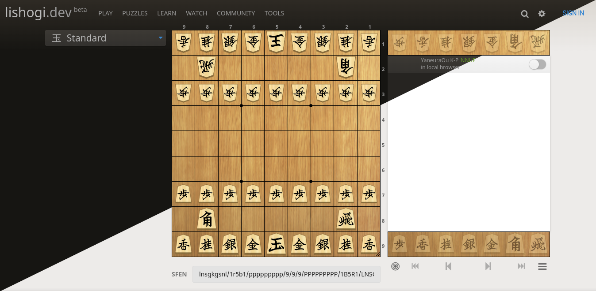

# [lishogi.org](https://lishogi.org)

Lila (li[shogi in sca]la) is a free online shogi game server focused on realtime gameplay and ease of use.

It features a [server analysis](https://lishogi.org/B8fAS7aW/gote) distributed with [shoginet](https://github.com/WandererXII/shoginet),
[local analysis](https://lishogi.org/analysis),
[tournaments](https://lishogi.org/tournament),
[simuls](https://lishogi.org/simul),
[forums](https://lishogi.org/forum),
[teams](https://lishogi.org/team),
[puzzles](https://lishogi.org/training),
[search engine](https://lishogi.org/games/search),
and a [shared analysis board](https://lishogi.org/study).

Lishogi is [Lichess](https://lichess.org) rewritten for shogi.
Lishogi is written in [Scala 2.13](https://www.scala-lang.org/),
and relies on the [Play](https://www.playframework.com/) framework.
[scalatags](https://com-lihaoyi.github.io/scalatags/) is used for templating.
Pure shogi logic is contained in the [shogi](modules/shogi) submodule.
The server is fully asynchronous, making heavy use of Scala Futures and [Akka streams](http://akka.io).
WebSocket connections are handled by a [separate server](https://github.com/WandererXII/lila-ws) that communicates using [redis](https://redis.io/).
It uses [MongoDB](https://mongodb.org) to store games.
HTTP requests and WebSocket connections can be proxied by [nginx](http://nginx.org).
The web client is written in [TypeScript](https://www.typescriptlang.org/) and [snabbdom](https://github.com/snabbdom/snabbdom), using [Sass](https://sass-lang.com/) to generate CSS.
The [blog](https://lishogi.org/blog) uses a free open content plan from [prismic.io](https://prismic.io).

[Join us on Discord](https://discord.gg/YFtpMGg3rR) for more info.
Use [GitHub issues](https://github.com/WandererXII/lishogi/issues) for bug reports and feature requests.

## Credits

This code exists because of [ornicar](https://github.com/ornicar), and the whole [Lichess project](https://github.com/lichess-org/lila)

## Supported browsers

| Name              | Version | Notes                                       |
| ----------------- | ------- | ------------------------------------------- |
| Chromium / Chrome | last 10 | Full support, fastest local analysis        |
| Firefox           | 67+     | Full support, second fastest local analysis |
| Edge              | 91+     | Full support (reasonable support for 17+) support                          |
| Opera             | 55+     | Reasonable support                          |
| Safari            | 11.1+   | Reasonable support                          |

Older browsers (including any version of Internet Explorer) will probably not work.
For your own sake, please upgrade. Security and performance, think about it!

## License

Li[shogi in scala]la is licensed under the GNU Affero General Public License 3 or any later
version at your choice with an exception for Highcharts. See [LICENSE](/LICENSE) and 
[COPYING.md](/COPYING.md) for details. WIP
